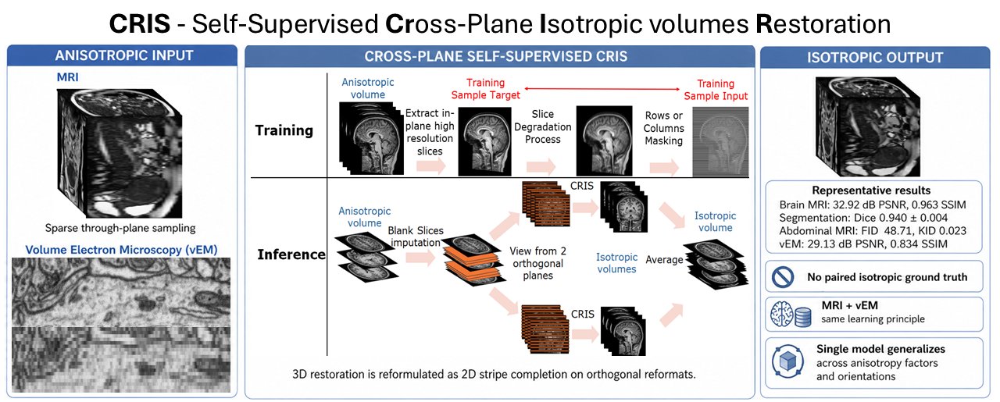
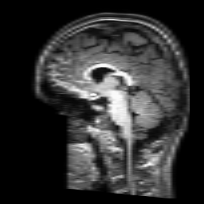
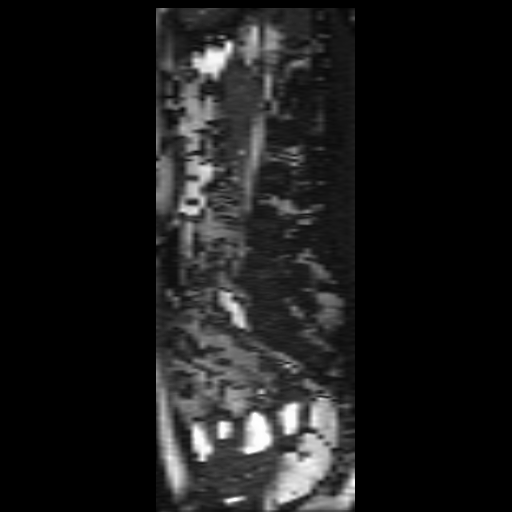
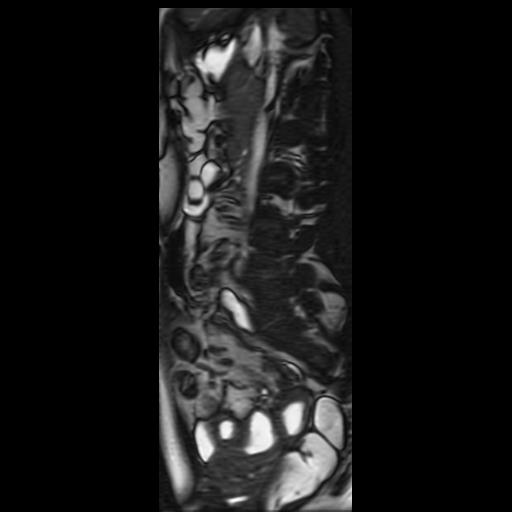

# CRIS — Cross-plane Reconstruction for Isotropic Slices

> **Paper:** TBD  
> **Authors:** TBD  
> **Links:** TBD (arXiv · paper · project page)

---



---

## Overview

Medical imaging modalities such as MRI and fluorescence microscopy routinely acquire volumes with **highly anisotropic voxel spacing**: in-plane resolution is far superior to the through-plane resolution (e.g. 5–6 mm slice thickness in MRI, or 4–8× axial downsampling in microscopy stacks). This limits 3D analysis, registration, and downstream deep-learning pipelines.

**CRIS** learns to impute the missing slices along the degraded axis. At inference, `(gap − 1)` blank slices are inserted along the degraded axis and the network fills them in. Predictions from two orthogonal planes are then averaged to produce a final **isotropic** volume. CRIS works across domains — brain MRI, abdominal MRI, and fluorescence / electron microscopy — without architectural changes.

Raw datasets, pre-built slice caches, and model checkpoints are **not** included in this repository.

---

## Installation

- Python 3.10
- CUDA-capable GPU (≥ 16 GB VRAM recommended for `patch_size=256`; ≥ 24 GB for `patch_size=512`)

```bash
conda create -n cris python=3.10 -y
conda activate cris
pip install -r requirements.txt
```

---

## Data format

### CSV manifest

CRIS expects a CSV file listing one volume per row.

| Column | Required | Description |
|--------|----------|-------------|
| `index` | Yes | Unique integer row identifier |
| `dataset` | Yes | Split label: `"train"`, `"val"`, or `"test"` |
| `axial` | At least one of these | Path to the volume for the **axial** plane |
| `coronal` | At least one of these | Path to the volume for the **coronal** plane |
| `sagittal` | At least one of these | Path to the volume for the **sagittal** plane |
| `intensity_min` | No | Per-case lower clip bound (only for `--intensity_norm_mode clip`) |
| `intensity_max` | No | Per-case upper clip bound (only for `--intensity_norm_mode clip`) |

You only need to populate the columns that match the planes you pass to `--planes`. Training on a single plane (e.g. `--planes coronal`) requires only the `coronal` column; all three planes are not needed unless you pass `--planes coronal,axial,sagittal`.

**Example — MRI, single file per subject (all three planes):** see [`docs/examples/dataset_manifest.csv`](docs/examples/dataset_manifest.csv).

When the source data is isotropic, point all three plane columns to the same file — CRIS slices the volume along each axis internally. For `--intensity_norm_mode clip`, add optional `intensity_min` and `intensity_max` columns to the CSV.

### Axis convention

CRIS loads volumes with **LPS** orientation (`SimpleITK.DICOMOrient(..., 'LPS')`). The resulting NumPy array has shape `(Z, Y, X)`:

| Plane | Array axis | Meaning |
|-------|-----------|---------|
| Axial | **Z** (axis 0) | Superior → Inferior |
| Coronal | **Y** (axis 1) | Anterior → Posterior |
| Sagittal | **X** (axis 2) | Left → Right |

#### Validating orientation before training

Before training, verify that CRIS is slicing along the correct anatomical axes for your data. When you build the slice cache (`--build_slice_cache True`) or after the first training epoch, CRIS saves sample slice images to `<main_dir>/figures/`. Open a few of those images and confirm that each plane (axial, coronal, sagittal) looks anatomically correct. If any view appears rotated or flipped, the source orientation tag in your files may differ from LPS — check the header and adjust accordingly.

---

## Intensity normalisation

All intensities are mapped to **[−1, 1]** before the network sees them; the model output is also in [−1, 1] (enforced by `tanh`). Select the mode with `--intensity_norm_mode`:

| Mode | How it works | Best for | Extra args needed |
|------|-------------|----------|------------------|
| `minmax` *(default)* | Per-volume min–max rescale to [−1, 1], no clipping | Microscopy | — |
| `stretch` | 0.05th / 99.9th percentile bounds, then linear stretch of the top 10 % into [−1, 1] | MRI with unknown intensity range | — |
| `clip` | Clip each volume to its own `[intensity_min, intensity_max]` from the CSV row, then map to [−1, 1] | CT or MRI with known per-case windowing | `intensity_min`, `intensity_max` CSV columns |
| `fixed_range` | Clip every volume to the same `[intensity_min, intensity_max]` (CLI args), then map to [−1, 1] | Cohort with a single known intensity window | `--intensity_min`, `--intensity_max` flags |

> `stretch` is the recommended default for brain MRI — it handles variable scanner protocols without per-case metadata.

---

## Running the code

### Quick start

`running_script_example.py` is a template launcher with **no hardcoded data paths**. Pass your CSV and output directory on the command line; optional flags mirror common training presets (brain MRI, abdomen MRI, microscopy).

```bash
conda activate cris
cd /path/to/CRIS

# Brain MRI (default preset)
python running_script_example.py \
  --csv_path  /your/data/manifest.csv \
  --main_dir  /your/output/run/ \
  --preset    brain_mri \
  --phase     train \
  --gpu_ids   0

# Fluorescence microscopy
python running_script_example.py \
  --csv_path  /your/data/manifest.csv \
  --main_dir  /your/output/run/ \
  --preset    microscopy \
  --phase     train \
  --gpu_ids   0
```

Run `python running_script_example.py --help` for all presets and flags.

### Training (direct CLI)

```bash
python train.py \
  --phase             train \
  --csv_path          /path/to/dataset.csv \
  --main_dir          /path/to/output/ \
  --planes            coronal,axial,sagittal \
  --default_plane     coronal \
  --patch_size        256 \
  --gap               5 \
  --domain            MRI \
  --n_epochs          120 \
  --batch_size        24 \
  --base_filters      118 \
  --window_size       8 \
  --learning_rate     0.0001 \
  --patience          20 \
  --gpu_ids           0 \
  --intensity_norm_mode stretch \
  --export_isotropic_volumes
```

For **microscopy**: set `--domain microscopy`, `--patch_size 128`, `--window_size 4`. See [`docs/cli.md`](docs/cli.md#patch_size--window_size-compatibility) for other valid `patch_size` / `window_size` pairs.

### Inference only (evaluation)

```bash
python train.py \
  --phase         evaluation \
  --csv_path      /path/to/dataset.csv \
  --main_dir      /path/to/run_with_saved_models/ \
  --default_plane coronal \
  --patch_size    256 \
  --gpu_ids       0
```

`evaluation` mode only processes rows where `dataset == "test"`. Outputs land in `<main_dir>/isotropic_volumes/`.

### Post-hoc metrics (brain MRI & microscopy)

After exporting isotropic volumes, run the generic evaluation scripts. Edit the `CONFIGURATION` block at the top of each script (paths marked `TODO`), then:

```bash
# Brain MRI — CRIS vs interpolation vs ground truth
python scripts/evaluate_mri.py

# Fluorescence microscopy — CRIS vs bicubic vs ground truth
python scripts/evaluate_microscopy.py
```

---

## Key options

Full CLI reference and `patch_size` / `window_size` compatibility: **[`docs/cli.md`](docs/cli.md)**.

| Flag | Notes |
|------|--------|
| `--phase` | `train` or `evaluation` |
| `--csv_path`, `--main_dir` | Required |
| `--planes` | Comma-separated; only the matching CSV columns are needed |
| `--patch_size` | Required; pair with `--window_size` — see [`docs/cli.md`](docs/cli.md#patch_size--window_size-compatibility) |
| `--gap` | Simulated slice spacing (every `gap`-th slice kept) |
| `--domain` | `MRI` or `microscopy` |
| `--intensity_norm_mode` | See [Intensity normalisation](#intensity-normalisation) |
| `--no_degradation` | Skip in-plane blur — see [`docs/cli.md` § No-degradation mode](docs/cli.md#no-degradation-mode) |

### Output layout

```
<main_dir>/
├── models/
│   ├── best_model.pth
│   └── <epoch>_model.pth
├── metrics.json
├── figures/
├── CRIS_Dataset/              # slice cache (--build_slice_cache True)
│   └── <plane>/train|val/
└── isotropic_volumes/
    └── <dataset>/<plane>/<view>/<case>/
        ├── CRIS_volume.nii.gz
        └── CRIS_volume.pt
```

---

## Visual examples

### Brain MRI — sagittal view

| Interpolation | CRIS | Ground truth |
|:---:|:---:|:---:|
|  |  |  |

### Abdominal MRI — sagittal view

| Interpolation | CRIS |
|:---:|:---:|
|  |  |

---

## Citation

Paper details TBD. When available, cite as:

```bibtex
@article{cris2026,
  title   = {TBD},
  author  = {TBD},
  journal = {TBD},
  year    = {TBD},
}
```
